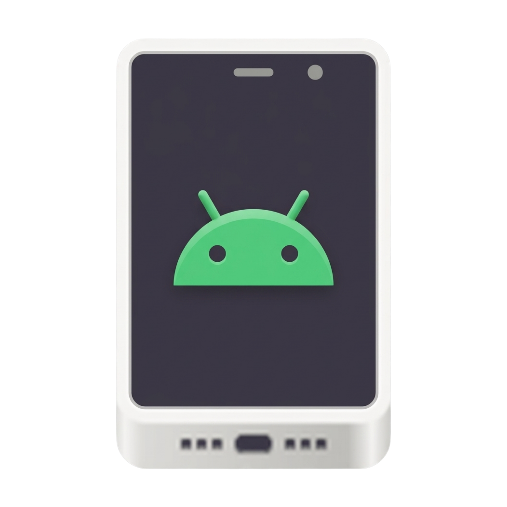

<p align="center">
  
</p>

<h1 align="center">DroidTux - Android Desktop Integrator 🐧📱</h1>

<p align="center">
  <a href="#english">English</a> | <a href="#español">Español</a>
</p>


---

## Español

DroidTux es una herramienta diseñada para integrar de forma fluida tus aplicaciones de Android directamente en tu escritorio Linux. Utiliza `scrcpy` para la transmisión de pantalla y un pequeño "Bridge" en el dispositivo para extraer iconos y etiquetas originales, creando archivos `.desktop` que permiten lanzar aplicaciones de Android como si fueran nativas.

### ✨ Características
- **Integración Nativa:** Lanza aplicaciones de Android desde tu menú de aplicaciones (GNOME, KDE, XFCE, etc.).
- **Extracción de Iconos:** Obtiene los iconos y nombres reales de las aplicaciones del dispositivo.
- **Sincronización Automática:** Gracias a las reglas `udev`, DroidTux puede sincronizar tus aplicaciones automáticamente al conectar el móvil por USB.
- **Dashboard GTK:** Una interfaz sencilla para gestionar la sincronización y ver los logs.
- **Multidisplay:** Utiliza las capacidades de `scrcpy` para crear displays virtuales con resoluciones personalizadas.

### 📋 Requisitos
- **Linux:** Con Python 3, `scrcpy`, `adb` y librerías GTK3.
- **Android:** Depuración USB habilitada. Se recomienda habilitar "Instalar vía USB" en opciones de desarrollador para la mejor experiencia.

### 🚀 Instalación
1. Clona este repositorio.
2. Asegúrate de tener el APK del bridge generado (o usa el incluido):
   ```bash
   ./build_bridge.sh
   ```
3. Ejecuta el script de instalación:
   ```bash
   chmod +x install.sh
   ./install.sh
   ```

### 🛠️ Desarrollo
Para compilar el bridge de Android manualmente, necesitas el SDK de Android (aapt2, d8, apksigner, etc.) y ejecutar:
```bash
./build_bridge.sh
```

---

## English

DroidTux is a tool designed to seamlessly integrate your Android applications directly into your Linux desktop. It leverages `scrcpy` for screen mirroring and a small "Bridge" app on the device to extract original icons and labels, creating `.desktop` files that allow you to launch Android apps as if they were native.

### ✨ Features
- **Native Integration:** Launch Android apps from your application menu (GNOME, KDE, XFCE, etc.).
- **Icon Extraction:** Fetches real icons and names from the device.
- **Automatic Sync:** Thanks to `udev` rules, DroidTux can automatically sync your apps when connecting your phone via USB.
- **GTK Dashboard:** A simple interface to manage synchronization and view logs.
- **Multidisplay:** Uses `scrcpy` capabilities to create virtual displays with custom resolutions.

### 📋 Prerequisites
- **Linux:** Python 3, `scrcpy`, `adb`, and GTK3 libraries.
- **Android:** USB Debugging enabled. Enabling "Install via USB" in developer options is highly recommended for the best experience.

### 🚀 Installation
1. Clone this repository.
2. Ensure the bridge APK is generated (or use the included one):
   ```bash
   ./build_bridge.sh
   ```
3. Run the installation script:
   ```bash
   chmod +x install.sh
   ./install.sh
   ```

### 📦 Packages (Debian, Fedora, Arch Linux)
You can generate native packages for your distribution using the `package.sh` script. This script requires `fpm`:
```bash
./package.sh [version]
```
This will generate `.deb`, `.rpm`, and `.pkg.tar.zst` files in the root directory.

You can also find the native definition files in the `packaging/` folder:
- **Arch Linux:** `packaging/arch/PKGBUILD`
- **Fedora:** `packaging/fedora/droidtux.spec`

To uninstall the package version:
- Debian: `./uninstall_deb.sh`
- Fedora: `./uninstall_rpm.sh`
- Arch Linux: `./uninstall_pacman.sh`

### 🛠️ Development
To manually compile the Android bridge, you need the Android SDK (aapt2, d8, apksigner, etc.) and run:
```bash
./build_bridge.sh
```

---
*Developed with ❤️ by JaimeGH.*
*vreadme1.2.1*
